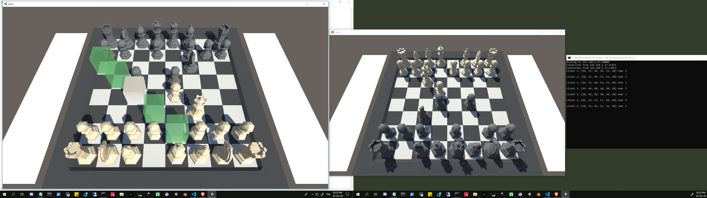

# Simple Unity Chess Client and its server

Some rules are not implemented (roc, En passant for example). I made this to learn Unity, once I got the game running I stopped there to moved on another project. But why I may implement it fully later, why not.
launch the chess server first (Instructions in the directory server/)

## Requirements

see requirements.txt

## Building the Game

- Add an env variable UNITYPATH with the path to your Unity.exe.
- launch build_client.exe
- the game executable is now at builds/chess.exe

## Screenshot

A game

